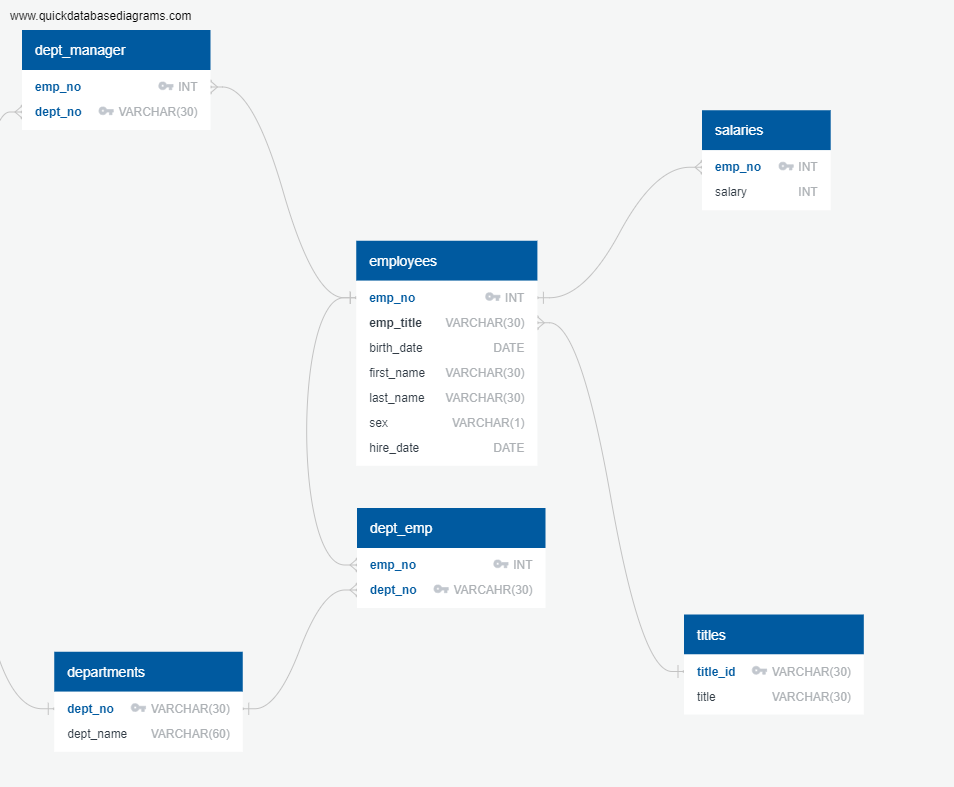

# sql-challenge
SQL using SQL Postgres

Using the Table which was given,I was able to complete an ERD diagram modelling the relationship between the tables. I identfied primary, foreign, and composite keys along woth Data types. Exporting this I diagram, I was able to input te diagram into PGAdmin SQL Postgres to make the queries to import the data with the creation of the tables. The tables creation query is in table_creation_table.sql. 

After importing the data, queries for different results was possible, which is in the result_query.sql file. 